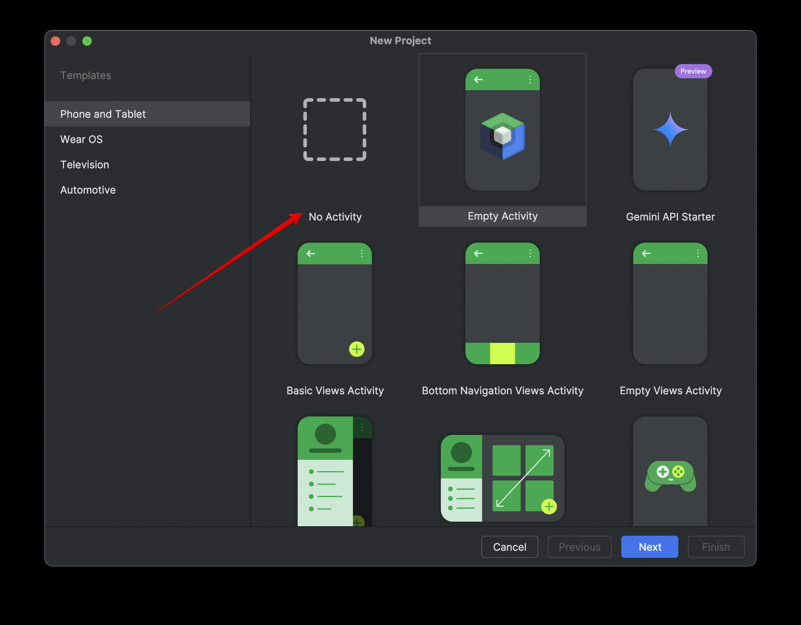
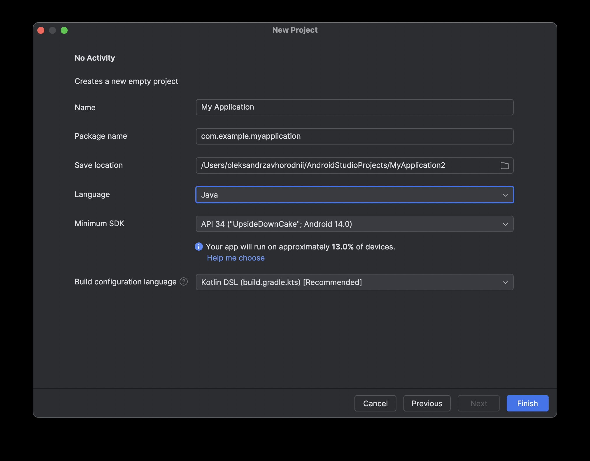
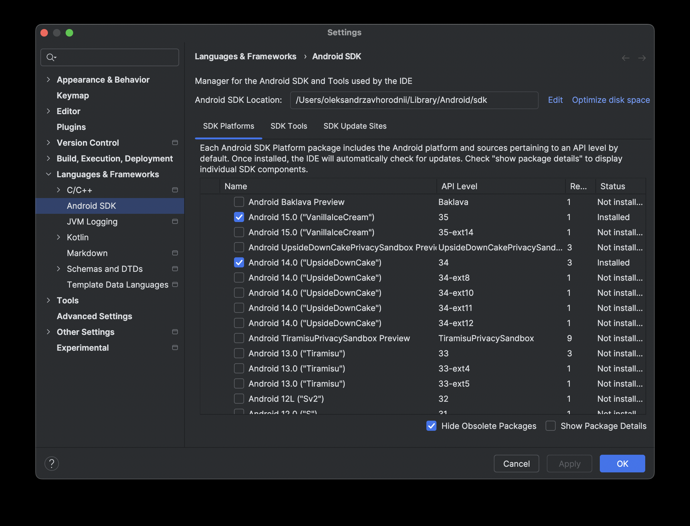
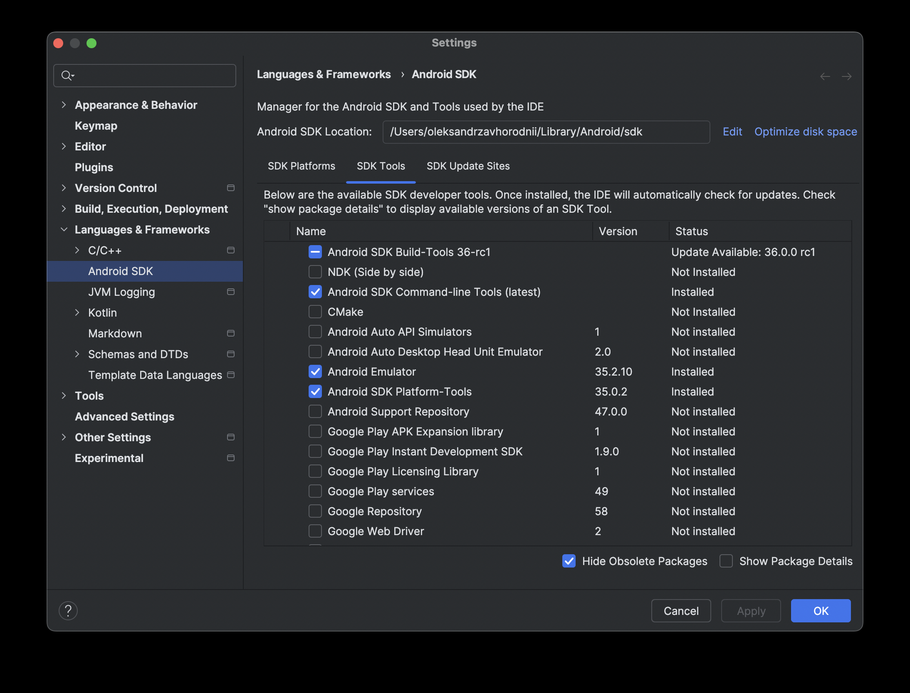
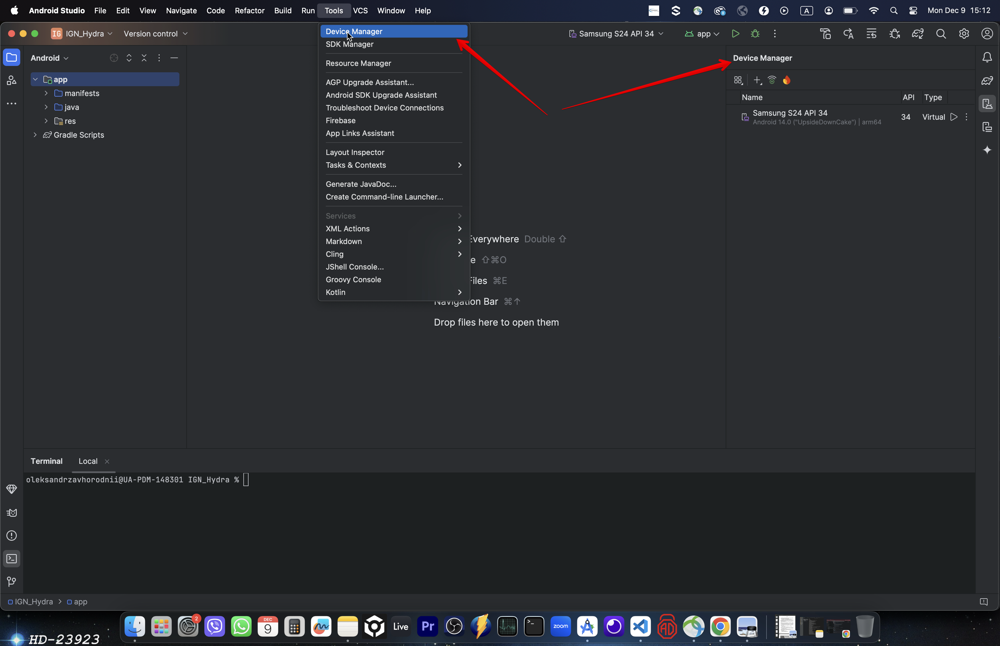
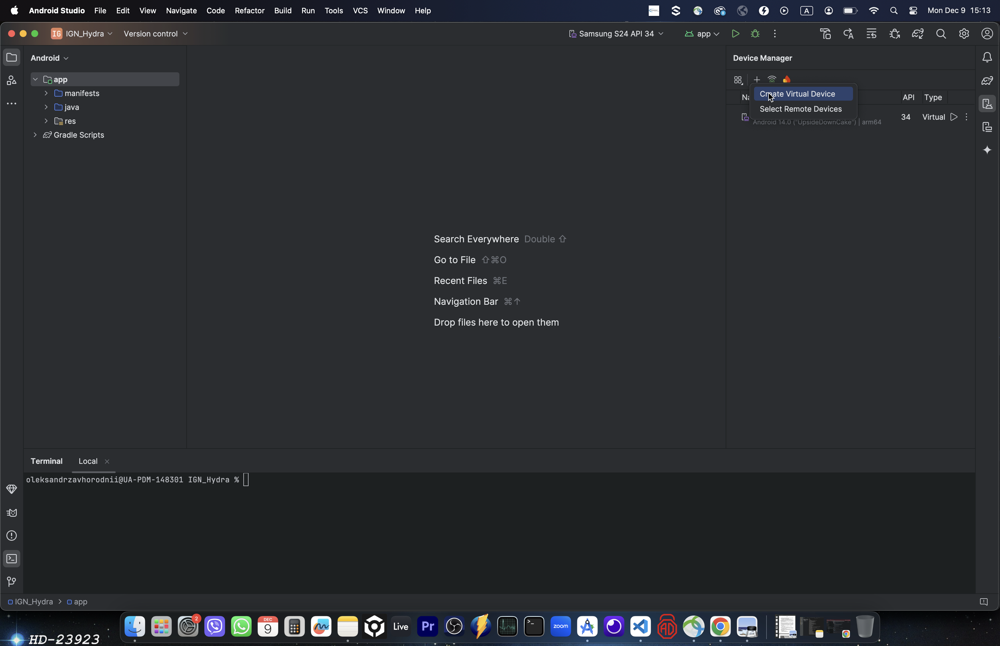
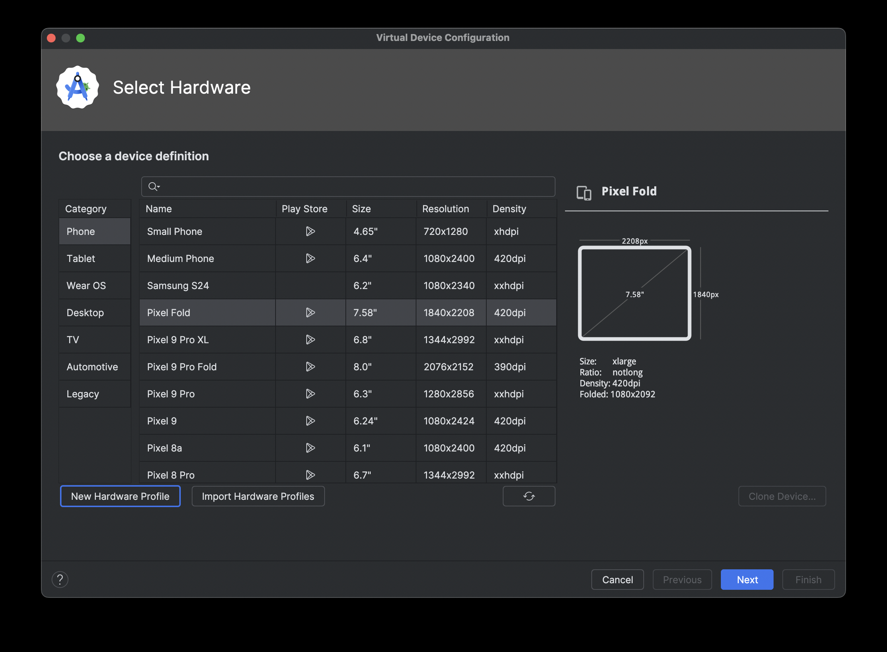
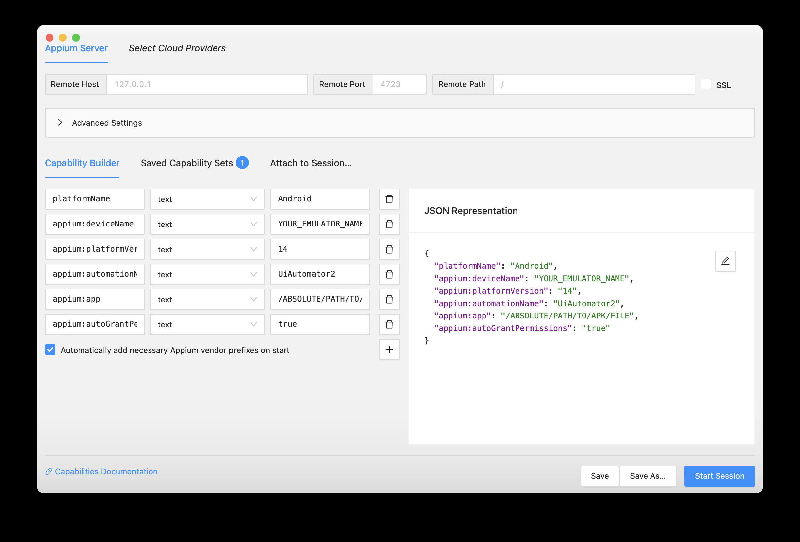
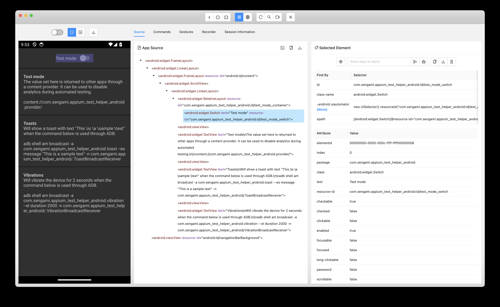

- [General Setup](#general-setup)
- [Configuration](#configuration)
- [Parametrized Test Runs](#parametrized-test-runs)
- [Suite-based specs](#suite-based-specs)
- [Page objects](#page-objects)
- [Reporting](#reporting)
- [Android Tests Setup](#android-tests-setup)
  - [Android Emulator Setup - MacOS](#android-emulator-setup---macos)

## General Setup
1. Install jdk https://www.oracle.com/java/technologies/downloads
2. Install Android Studio https://developer.android.com/studio
3. Clone this repo
4. Run `npm i && npm i -g allure-commandline`
5. See `package.json` for available commands

### Configuration
This project has a 2-level config setup
1. Root config `wdio.conf.ts` contains common properties for all sub-configs
2. Child configs (e.g. `wdio.web.conf.ts` or `wdio.android.conf.ts`) contain project-specific capabilities & settings

### Parametrized Test Runs
This setup is designed to be ultra-flexible and supports: 
   - multi-env test runs
   - multi-app test runs
   - multi-suite test runs
   - parallel test runs
In order for this to work:
1. Create your files containing env variables in such format `.env.ENV_NAME` (e.g. `.env.stage` or `.env.prod`)
2. Specific Environment (e.g. `stage`, `prod`) is passed as an argument via tests launch command. 
   - The `ENV` value should be the same as `ENV_NAME` in your `.env.ENV_NAME` file name.
3. Specific App (e.g. `testApp`) is passed as an argument via tests launch command.
   - This argument is taken as a `appName` variable value which is used for suite specs path declaration in `wdio.web.conf.ts`
4. Specific Suite (e.g. `E2E`, `ALL`) is passed as an argument via tests launch command.
   - This argument is taken as a `suiteName` variable value which is used for suite specs path declaration in `wdio.web.conf.ts`
5. Specific Max Instances (e.g. `1`, `2`, `3`) is passed as an argument via tests launch command.
   - This argument is taken as a `maxInstances` variable value which is used for max instances declaration in `wdio.web.conf.ts`
6. See `package.json` for example commands with these arguments:
- `npm run testApp:web:e2e:stage`
- `npm run testApp:web:e2e:prod`
- `npm run testApp:web:all:stage`
- `npm run testApp:web:all:prod`

### Page objects
1. Page-specific objects are located in `pages` folder
2. There's a global object named `PageManager` which is located in `utils/pageManager.ts` file and is initialized before the tests start running (see `before` hook inside the `wdio.conf.ts` config file)
3. This allows us not to import separate page objects inside the specs, but rather call them from the global object (e.g. `pages.loginPage.open()`)

### Reporting
Allure report is being used as final reporting tool.
Here's the logic:
1. Before tests start running - the `html-report` folder is cleared, so that all previous report results are removed (see `onPrepare` hook inside the `wdio.conf.ts` config file)
2. Screenshots & videos are being generated & saved for failed tests only (see `afterTest` hook inside the `wdio.conf.ts` config file)
3. Allure report is generated automatically after all tests have finished running (see `onComplete` hook inside the `wdio.conf.ts` config file)
4. Report can be opened locally via command `npm run allure:open`

### Cleanup
Before & after running tests, it's recommended to kill all processes & ports that are running on the machine:
1. run `chmod +x ./scripts/*` to make scripts executable
2. `npm run kill-processes` - kills all processes that are running on the machine
3. `npm run kill-ports` - kills all ports that are running on the machine

## Android Tests Setup
1. Mobile configuration consists of 2 levels:
   - root config `wdio.conf.ts` with common properties & hooks
   - child config `wdio.android.conf.ts` which contains Android-specific properties
2. Appium start/stop script is located in `./utils/appium.ts`. Use the following commands to start/stop Appium:
   - `npm run appium:start`
   - `npm run appium:stop`
3. Android emulator settings:
4. If you have previously created an emulator - then refer to the emulator script in `./utils/androidEmulator.ts`. Use the following commands to start/stop emulator:
   - `npm run android:emulator:start`
   - `npm run android:emulator:stop`
5. Mobile tests, as any other tests, use the same logic with Allure reporter, which gets generated after tests finished running, and can be opened with `npm run allure:open`

## CI / CD Setup
TBD

### Android Emulator Setup - MacOS
In Android Studio:
1. Create a new project with "No activity" option 
2. Select other settings (such as minimum SDK or language) 
3. Go to `Android Studio -> Settings -> Languages & Frameworks -> Android SDK -> SDK Platforms` if you need to install additional Android OS versions 
4. Make sure you installed `Android SDK Command-line Tools`, `Android Emulator` and `Android SDK Platform Tools` in the `SDK Tools` tab 
5. Navigate to `Tools -> Device Manager` to add new device 
6. Click on `+` icon and then on `Create Virtual Device` to toggle available device profiles 
7. Select existing or create your own device profile 
8. (Optionally) check that your device has been added via terminal `adb devices` -> should list something like `emulator-5554 device`

Add Android Studio to your PATH:
1. In terminal, go to your `.zsh` profile `nano ~/.zshrc`
2. Make sure you have Java and Android variables in your PATH:
```
export JAVA_HOME=$(/usr/libexec/java_home)
export ANDROID_HOME=/Users/{{YOUR_MAC_USER_NAME_HERE}}/Library/Android/sdk
export PATH=$PATH:$ANDROID_HOME/emulator:$ANDROID_HOME/platform-tools:$ANDROID_HOME/tools:$ANDROID_HOME/tools/bin
```
3. Reload the shell `source ~/.zshrc`

### Android Test Development
1. Install Appium Inspector in the `Assets` section from https://github.com/appium/appium-inspector/releases
2. Start Appium `npm run appium:start`
3. Start the emulator `npm run android:emulator:start`
4. Open Appium Inspector and connect to the emulator via this manual https://appium.github.io/appium-inspector/latest/quickstart/starting-a-session/ , here's an example session setup 
5. Use Appium Inspector to find the element selectors, record sessions e.t.c. 
6. Use the element selectors in your page object files & develop specs as usual

### Running Android Tests
1. Start Appium `npm run appium:start`
2. Start the emulator `npm run android:emulator:start`
3. Run the tests `npm run testApp:mobile:android:all:stage`
4. Stop the emulator `npm run android:emulator:stop`
5. Stop Appium `npm run appium:stop`